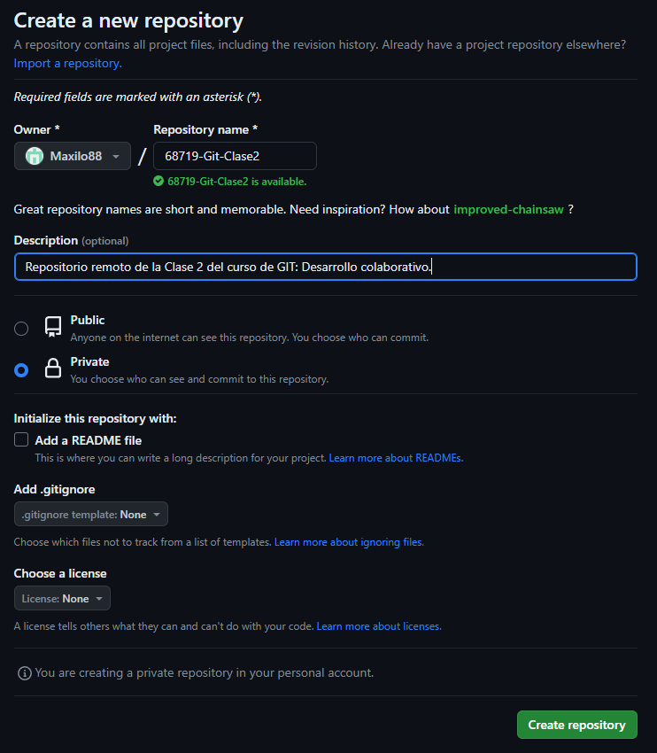
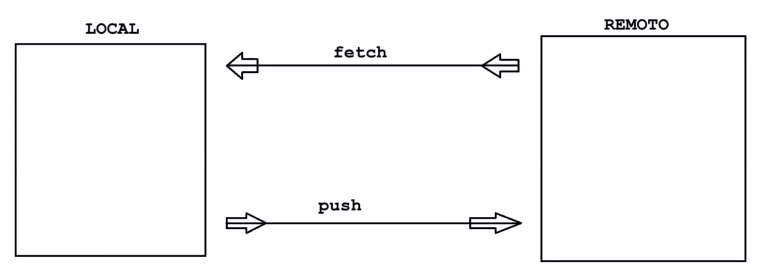
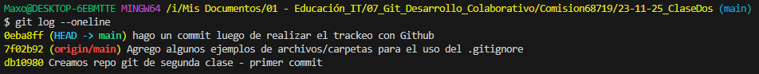
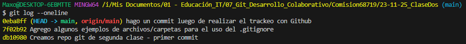
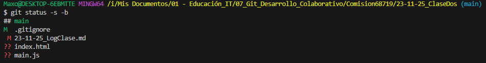

# Log clase del 25/11/23 de Git: Desarrollo Colaborativo:

- Instructor: Maximiliano Luis Principe.
- Comisión: 68719.

## Temas Vistos:

- revisamos temas de la clase pasada **()
### Archivo .gitignore **(15:16hs)**
    - genero un archivo .gitignore, de esta manera podemos decirle a git que archivos ignorar en el "git status"
    - Generalmente este archivo se coloca en el root del proyecto.
    - damos un ejemplo con un archivo .env (el cual generalmente tiene info sensible del proyecto y no debe ser compartido) **(15:22hs.)**
### Servicios disponibles para trabajar en la nube **(15:30hs.)**
- BitBucket.
- GitLab
- GitHub
### Uso de GitHub **(V. 26:30 min)**
#### Creación de repositorio nuevo en GitHub.
- Vista de Github sobre la creación de nuevo repositorio.


#### Comunicación del repositorio local, con el repositorio de la nube.
- Comando para hacer un push del repositorio recién creado en Github, con el repo local
```sh
git remote add origin https://github.com/Maxilo88/68719-Git-Clase2.git # es el URL que nos da Github sobre el repositorio creado y a donde queremos apuntar.
```
el nombre "origin" es un alias que puede ser cualquiera, pero por convención se utiliza "Origin"

- comando `git remote` (info resumida) y `git remote -v` (info ampliada "verbose)
    - nos tira dos direcciones: FETCH -> traer información del remoto al local y PUSH -> llevar información del local al remoto.
    
        - quitar enlace remoto:
```sh
git remote remove <alias>  
```
- Subir el local al remoto (se realiza una vez por cada rama):
"-u" upstream: Trakea o sigue la rama local con la rama remota que se crea al subirlo.
"Remoto" : Nombre del repositorio remoto, en nuestro caso "Origin"

"Rama-local": sería el main

```sh
git push -u <remoto> <rama-local> # General
git push -u origin main # Para nuestro caso particular de estudio.
```
- Visualización del comando 'git log --oneline' luego de trackear



La consola nos muestra a partir de que Commit fue realizado el push con el repositorio remoto y en que commit se encuentra actualmente el repositorio local main. por otro lado el "apuntador" HEAD, mostrará donde estamos parados actualmente.
En el siguiente print se realiza el mismo log pero luego de realizar un push.



Esto significa que tanto el repo local como el remoto contienen el último commit realizado. Lo que no quiere decir que podamos hacer modificado el repo actual sin realizar un commit nuevo.

### Commit para segmentos de archivo de repositorio, git diff,  **(15:55hs)**
- Comando "add --patch" para comitear parte de un archivo, dejando fuera otros sectores del programa. FUNCIONALIDAD IMPORTANTE. 
- Comando "git diff"
- Comando "git status --short" o "git status -s" **(16:18hs)**

### Commit con mensajes largos **(16:27hs.)**

```sh
git commit # abre el editor de texto para un mensaje largo.
```

### Alias en los comandos **(17:00hs.)**
- Escribiendo un atajo me permite ejecuta un comando de git con varias opciones

```sh
git config --global alias.s "status -s"
git config --global alias.ll "log"
git config --global alias.l "log --oneline"
```
- Para borrar un alias:

```sh
git config --global --unset alias.ll
```

- Listar los alias activos:

```sh
git config --get-regexp alias
```
### Manejo de Ramas (Branches) **(17:06hs.)**

- Generación de una nueva rama, que se genera en el último comit donde se encuentra el main.
```sh
git branch [nombre de la rama] # Crear nueva rama.
```
- listar Ramas: 

```sh
git branch
```

- Moverme entre ramas: git switch [nombre rama]

```sh
git switch - # Switchea entre la ultima rama en donde estuve.
```
- Para borrar una rama: 

```sh
git branch -d [nombre_rama]
```

- Para borrar una rama cuya unformación no existe en nunguna otra rama (previamente el sistema nos consulta el borrado de la rama): git branch -D [nombre_rama]. este comando fuerza el borrado de la rama.
- Comando para crear rama y moverme a ella **(17:36hs.)**:

```sh
git switch -c [nombre_rama].
```

# NOTAS PERSONALES POSTERIORES A LA CLASE:

### Comandos ya vistos pero que se revisaron en esta clase:

- Help para los comandos: Abre un archivo local en el browser predeterminado donde me muestra la documentación de ese comando.

```sh
git [comando] --help
git status --help # Ejemplo
```

- Usos varios del comando Status:
```sh
git status -s # significa short, modo abreviado.
git status -s -b # ademas de short muestra la rama en la que se encuentra.
git status --ignored # muestra todos los archivos incluidos los que se encuentran en el archivo .ignore.
```
Importante ver el --help de este comando para la explicación del status "short", ya que se muestra la estructura en dos columnas. Vemos un ejemplo:



La primer columna contiene lo que está en staging área y del derecho lo que tenemos en el working directory. si no hay modificaciones, no se muestra ninguna letra. **dicho por el profe en V. 01:12:30**

### Sobre el ejercicio del Módulo 2 del laboratorio adicional:

- Se crean Branches para visualizar los cambios en el repositorio local según lo siguiente:

1. Crear una nueva rama llamada 'testing' y
mostrar las ramas del repositorio.
2. Crear una nueva rama llamada 'navbar' y
mostrar las ramas del repositorio.
3. Crear una nueva rama llamada 'accounting'
y mostrar las ramas del repositorio.

vamos a realizar diferentes modificaciones en el archivo index.html para mostrar como funcionan las ramas. veremos que las modificaciones de una no afectan a las otras. Al final quedará el trabajo a medio terminar, atento a que a este punto del curso, aún no habíamos visto la funcionalidad de Merge 